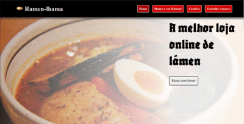

<h1>Rámen-Ecommerce</h1>
<h2>Sua loja virtual de rámens</h2>
!!!!Projeto ainda em andamento!!!

Este projeto foi feito inteiramnete para treino de habilidades adquiridas através de curso  

<h2>algumas das habilidades envolvidas:</h2>
<ul>
    <li>HTML e CSS (flexbox, arquitetura css)</li>
    <li>SEO</li>
    <li>Javascript DOM</li>
    <li>Figma - básico</li>
    <li>Javascript orientado a objetos</li>
    <li>Javascript localstorage</li>
    <li>Responsividade</li>
</ul>

<h2>habilidades que serão futuramente implementadas:</h2>
<ul>
    <li>acessibilidade Web</li>
</ul>

## Quer abrir o projeto e ver como ele funciona?

abra o git bash e digite 'git clone https://github.com/PrieTorres/Ramen-commerce.git'
